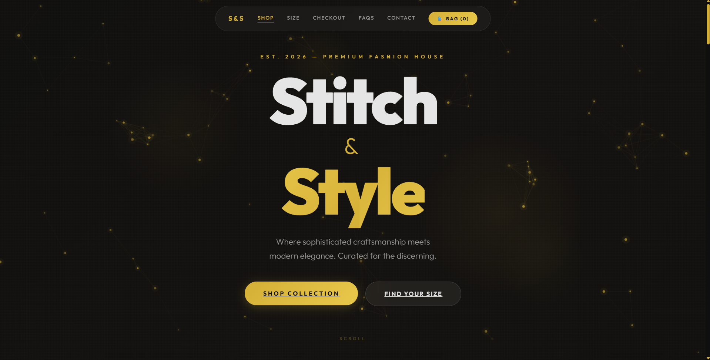
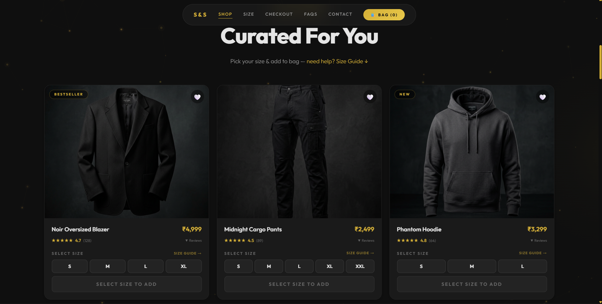
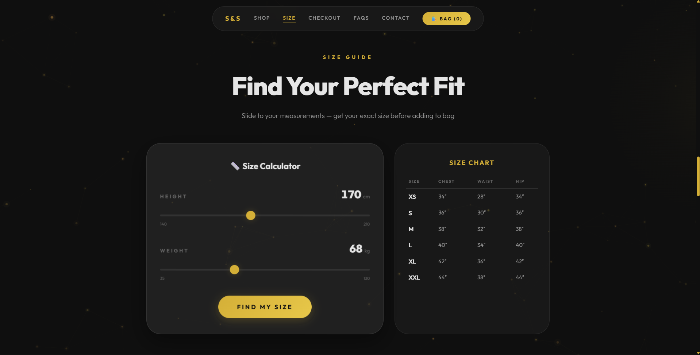
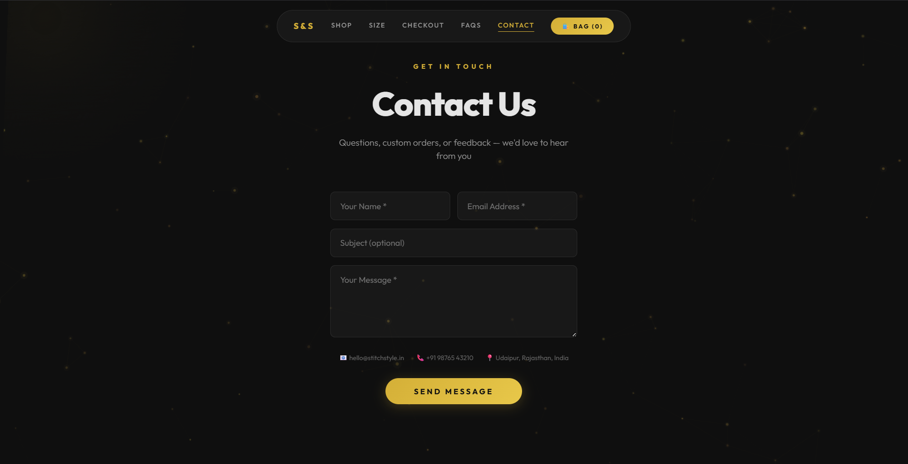

# ✂️ Stitch & Style

**Stitch & Style** is a premium fashion shopping website with a sleek, modern, and user-friendly design. It allows users to browse curated clothing products through an organized and fully responsive interface — demonstrating front-end web development skills including React component architecture, state management, CSS animations, and interactive UI design.

> **Note:** This is a front-end only project. There is no backend, database, or real payment processing. All product data is hardcoded and the checkout flow is simulated for demonstration purposes.

---

## 🌐 Deployment

🔗 **Live Demo:**(https://stitchnstyle.dixitkhushi288.workers.dev/)

---

## 📸 Preview

### Landing Page


### Product Grid


### Interactive Size Calculator


### Contact & Footer


---

## ✨ Features

### 🛍️ Shopping Experience
- **Product Catalog** — 8 fashion products with images, prices (₹1,499 – ₹7,999), star ratings, and product tags (Bestseller, New, Premium, Trending, Luxe)
- **Quick View Modal** — Click any product image to see full details, description, and reviews in an overlay
- **Wishlist** — Heart button to bookmark favorite items (per session)
- **Size Selector** — Pick from XS to XXL with visual feedback and error prompts
- **Add to Bag** — Animated success confirmation on adding items

### 🛒 Cart & Checkout
- **Cart Drawer** — Slide-out side panel showing all added items with quantity controls (+/−), remove, and clear options
- **3-Step Checkout Flow:**
  1. **Login** — Social login buttons (Google / Apple / Email — simulated)
  2. **Shipping** — Address form with gold-accent focus styling
  3. **Payment** — Choose between UPI (with QR code), Credit/Debit Card, or Cash on Delivery
- **Order Confirmation** — Animated success screen after placing an order

### 🎨 Design & Aesthetics
- **Dark Theme** — Deep black background (`#0F0F0F`) with champagne gold (`#D4AF37`) accents
- **Glassmorphism** — Frosted glass cards and navigation bar with backdrop blur
- **3D Tilt Cards** — Product cards respond to mouse position with perspective transforms and light reflections
- **Animated Particle Background** — Canvas-drawn golden particles with mouse-reactive parallax and connecting lines
- **Marquee Ribbon** — Infinite-scrolling brand name with alternating fill and stroke typography
- **Scroll Animations** — Sections fade in from different directions using IntersectionObserver
- **Parallax Hero** — Title and subtitle shift smoothly as the user scrolls
- **Magnetic Buttons** — CTA buttons subtly attract toward the cursor
- **Custom Scrollbar** — Gold-themed scrollbar that matches the design system

### 📏 Interactive Size Guide
- **Size Calculator** — Input height and weight using sliders; the app recommends a size (XS–XXL) based on BMI with fit category (Slim / Perfect / Comfort / Relaxed)
- **Size Chart** — Reference table with chest, waist, and hip measurements for each size

### ❓ FAQ & Contact
- **FAQ Accordion** — 8 expandable questions covering returns, shipping, sizing, payments, and garment care
- **Contact Form** — Name, email, subject, and message fields with gold-focus styling and submission feedback
- **Contact Info** — Email, phone, and location (Udaipur, Rajasthan)

### 📱 Responsive Design
- **Desktop** — 3-column product grid, side-by-side size guide layout
- **Tablet (≤768px)** — 2-column product grid, stacked layouts
- **Mobile (≤480px)** — Single-column product grid, full-width sections

---

## 🛠️ Tech Stack

| Technology | Purpose |
|-----------|---------|
| [React 19](https://react.dev/) | UI framework with functional components and hooks |
| [TypeScript](https://www.typescriptlang.org/) | Type-safe JavaScript for reliable component props and state |
| [Vite 6](https://vite.dev/) | Fast build tool with hot module replacement (HMR) |
| [Vanilla CSS](https://developer.mozilla.org/en-US/docs/Web/CSS) | Custom design system — no CSS frameworks used |
| [Outfit Font](https://fonts.google.com/specimen/Outfit) | Modern Google Font (300–900 weights) |

---

## 📂 Project Structure

```
Stitch-N-Style/
├── index.html                  # Entry HTML with SEO meta tags
├── package.json                # Dependencies and scripts
├── vite.config.ts              # Vite configuration
├── tsconfig.json               # TypeScript configuration
├── public/
│   ├── products/               # Product images
│   └── journey/                # Journey/story assets
└── src/
    ├── main.tsx                # React root mount
    ├── App.tsx                 # Main app — composes all sections
    ├── index.css               # Complete design system (CSS variables,
    │                           #   glassmorphism, buttons, animations,
    │                           #   responsive breakpoints)
    ├── context/
    │   └── CartContext.tsx      # Cart state management (Context API)
    └── components/
        ├── Navbar.tsx           # Fixed glassmorphism nav with section spy
        ├── HeroSection.tsx      # Full-viewport hero with parallax
        ├── GoldenThreadCanvas.tsx  # Canvas-drawn golden thread effect
        ├── MagneticButton.tsx   # Cursor-attracted button component
        ├── ScrollReveal.tsx     # IntersectionObserver reveal wrapper
        ├── MarqueeRibbon.tsx    # Infinite scrolling brand ribbon
        ├── ProductGrid.tsx      # Product cards + Quick View modal
        ├── SizeGuide.tsx        # BMI-based size calculator + chart
        ├── CartDrawer.tsx       # Slide-out cart side panel
        ├── Checkout.tsx         # 3-step checkout wizard
        ├── FAQSection.tsx       # Accordion FAQ section
        ├── ContactSection.tsx   # Contact form with info
        ├── Footer.tsx           # Footer + back-to-top button
        └── StoryJourney.tsx     # 3D particle background canvas
```

---

## 🚀 Getting Started

### Prerequisites
- [Node.js](https://nodejs.org/) (v18 or later recommended)
- npm (comes with Node.js)

### Installation

```bash
# Clone the repository
git clone https://github.com/Dixit-Khushi/Stitch-N-Style.git

# Navigate to the project directory
cd Stitch-N-Style

# Install dependencies
npm install
```

### Run Locally

```bash
# Start the development server
npm run dev
```

The app will be available at `http://localhost:5173/`

### Build for Production

```bash
# Create an optimized production build
npm run build

# Preview the production build locally
npm run preview
```

---

## 🎯 Purpose

This project was built purely to **demonstrate front-end web development skills**, including:

- ⚛️ **React** — Component-based architecture, hooks (`useState`, `useEffect`, `useRef`, `useMemo`, `useContext`), context API for state management
- 🔷 **TypeScript** — Typed props, interfaces, generics, and type-safe event handling
- 🎨 **CSS** — Custom design system with CSS variables, glassmorphism, responsive breakpoints, custom scrollbar, and 12+ keyframe animations
- 🖼️ **Canvas API** — Procedural particle system with mouse-reactive parallax and connecting lines
- 🧩 **UI/UX Patterns** — Slide-out drawers, modal overlays, accordion menus, multi-step forms, scroll-spy navigation, infinite marquee, 3D perspective transforms
- 📱 **Responsive Design** — Mobile-first approach with breakpoints for tablet and desktop

> No CSS frameworks, UI libraries, or external component packages were used — everything is built from scratch.

---

## 📄 License

This project is open source and available under the [MIT License](LICENSE).

---

<p align="center">
  <b>Stitch & Style</b> — Premium Fashion, Redefined.<br/>
  <sub>Built with ❤️ using React + TypeScript + Vite</sub>
</p>
